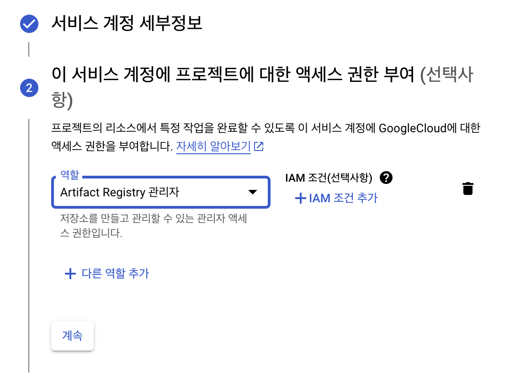
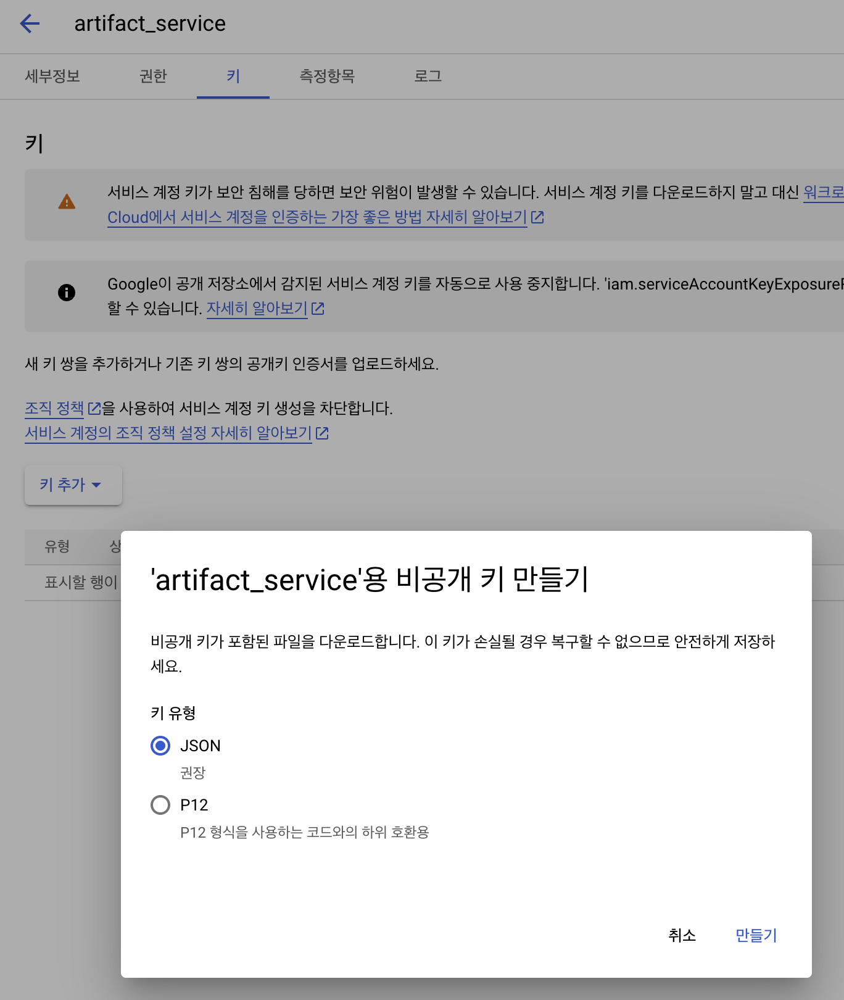

### 1. "IAM 및 관리자" -> "서비스 계정" 메뉴로 이동
```
서비스 계정 만들기를 클릭합니다.
```

### 2. 서비스 계정 세부정보 및 엑세스 권한 부여

```
서비스 계정 이름 : artifact_service
역할 : Artifact Registry 관리자
```

### 3. 서비스 계정 키 발급하기

```
1. "서비스 계정"
2. "artifact-service@[자신이 설정한 리소스].iam.gserviceaccount.com"
3. "키"
4. "키 추가"
5. "JSON 만들기"
6. 키 파일 자동 다운로드
해당 키 파일을 서버에 옮겨줍니다.
```