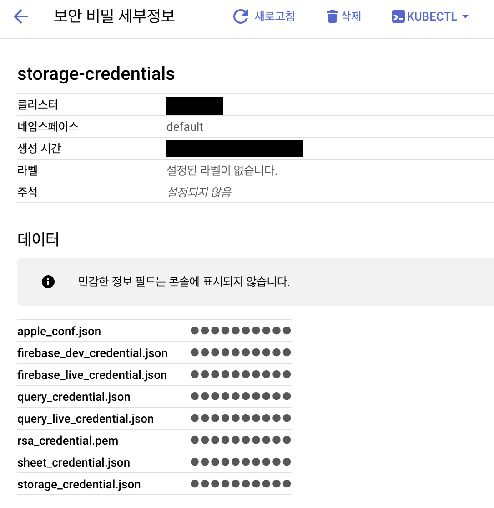

### 0. 폴더 구조
```
credential
 - 각종 config 파일들을 모아둔 폴더
default
 - kubernetes 구성을 위한 파일 폴더
kubernetes
 - 구성된 파일들을 보관하는 폴더
```

### 1. credential 폴더 내용
```
apple_conf.json
firebase_dev_credential.json
firebase_live_credential.json
query_credential.json
rsa_credential.pem
sheet_credential.json
storage_credential.json
```

### 1-2. credential 넣는 명령어

```
# 확인 위치
Kubernetes Engine -> 보안 비밀 및 ConfigMap

# 삭제
kubectl delete secret storage-credentials -n default

# 삽입
kubectl create secret generic storage-credentials \
  --from-file=./apple_conf.json \
  --from-file=./firebase_dev_credential.json \
  --from-file=./firebase_live_credential.json \
  --from-file=./query_credential.json \
  --from-file=./sheet_credential.json \
  --from-file=./storage_credential.json \
  --from-file=./rsa_credential.pem \
  -n default
```

### 2. default 폴더 내용
- [default Folder Content](/Code/default/)
```
configDefault.yaml
 - config 내용들 env 와 같은 데이터들을 "구성 맵 세부정보"에 추가한다.
default.yaml
 - kubernetes 기본적인 구조, 볼륨, 사양 등을 설정한다.
frontDefault.yaml
 - default.yaml과 동일하지만 웹사이트에서만 사용할 수 있는 설정들만 담고 있다.
hpaDefault.yaml
 - cpu, memory등 "수평형 포드 자동 확장 처리 구성"을 설정한다.
ingressDefault.yaml
 - 도메인과 ip를 연결 시켜주는 설정 (미리 tls 구성등을 넣어놓아야 한다.)
lbDefault.yaml
 - 로드밸런싱을 설정한다.
logstashDefault.yaml
 - logstash 관련 구성정보를 담고 있으며, "보안 비밀 및 ConfigMap"에 들어갈 내용이다.
```

### 2-1. tls 구성 방법
```
kubectl create secret tls website-tls \
         --cert=origin-certificate.pem \
         --key=origin-certificate-key.pem
```