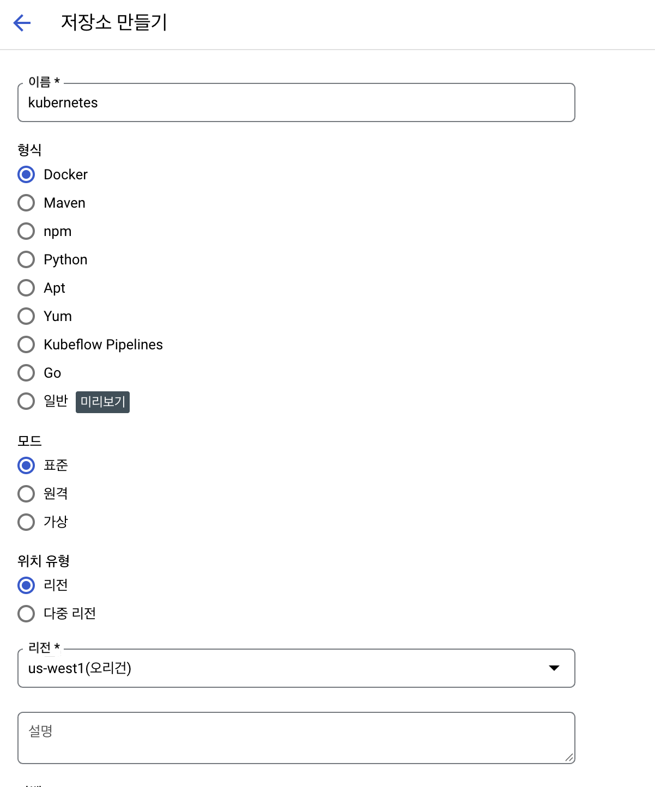
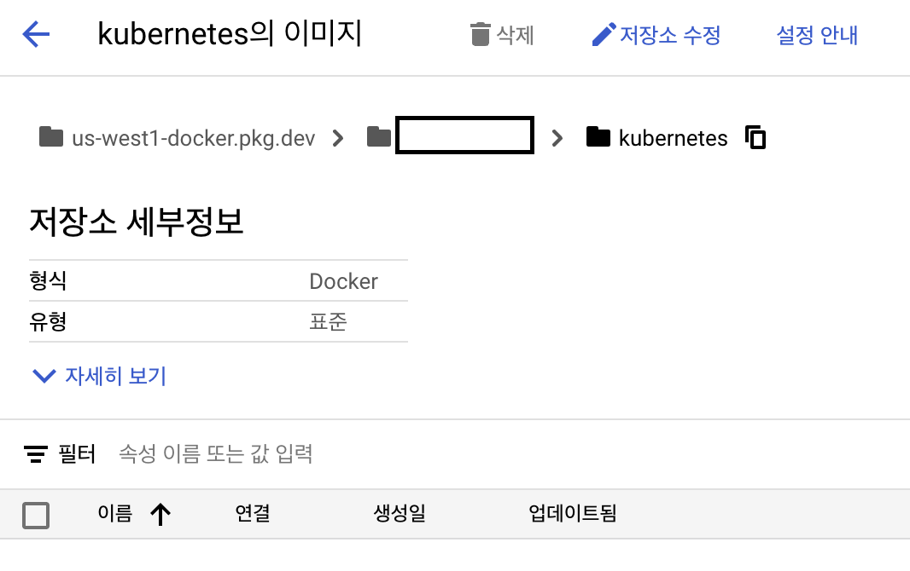
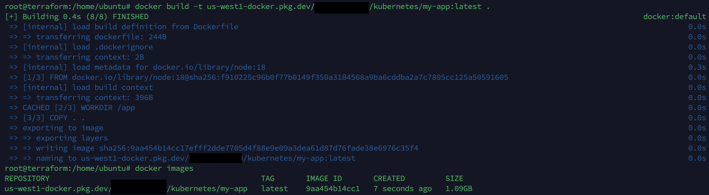
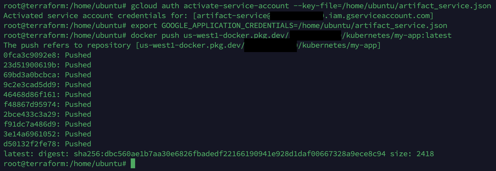
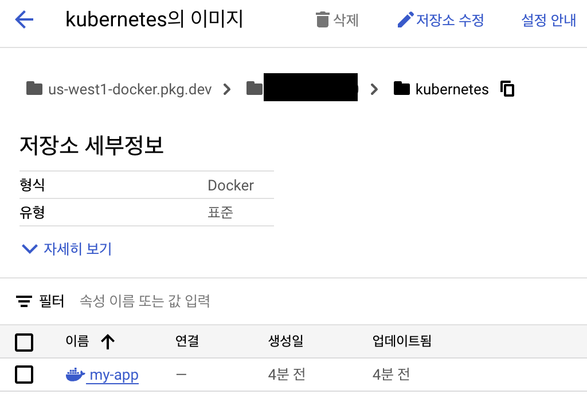

## GCP Kubernetes 설치 및 세팅 가이드
이 가이드는 GCP Kubernetes Autopilot 을 기반으로 Jenkins를 통해 배포하는 방법을 안내합니다.

### 1. Google Cloud CLI (gcloud) 설치 및 설정 방법
* [GCP 사용 방법](GoogleCloudStart.md)

### 2. Google Cloud Artifact Registry 설정하기

```
이름 (저장소 이름)
형식 (Docker)
모드 (표준)
위치유형 (사용하는 리전)
맞춰서 저장소를 만들어 줍니다.
```

### 3. Google Cloud Artifact Registry 주소 확인하기

```
복사하기 버튼을 눌러서 주소를 기억 합니다.
us-west1-docker.pkg.dev/[자신이 설정한 리소스]/kubernetes
```

### 4. Google Cloud Artifact Registry 서비스 계정 만들기
* [GCP Artifact Registry 서비스 계정 만들기](GoogleArtifactService.md)

### 5. Google Cloud Artifact Registry Push 확인하기
- Dockerfile 작성
- 
```
# Node.js 18 기반 이미지 사용
FROM node:18

# 작업 디렉토리 설정
WORKDIR /app

# 애플리케이션 코드 복사
COPY . .

# 애플리케이션 시작 명령어 설정
CMD ["npm", "start"]
```
- Docker Build 진행 및 이미지 확인
- 
```
docker build -t us-west1-docker.pkg.dev/[자신이 설정한 리소스]/kubernetes/my-app:latest .
docker images
```
- Docker Push 진행
- 
```
# Artifact Registry 서비스 계정 Key 파일을 설정해줍니다.
gcloud auth activate-service-account --key-file=/home/ubuntu/artifact_service.json
export GOOGLE_APPLICATION_CREDENTIALS=/home/ubuntu/artifact_service.json

# gcloud docker auth 인증
gcloud auth configure-docker us-west1-docker.pkg.dev

# 설정 이후 Push 합니다.
docker push us-west1-docker.pkg.dev/[자신이 설정한 리소스]/kubernetes/my-app:latest
```

### 6. Google Cloud Artifact Registry 업로드 확인하기

```
이미지가 정상적으로 업로드가 되었는지 확인을 합니다.
```

### 7. Jenkins Go Build & Push & Run 방법
* [Jenkins Build](Jenkins.md)